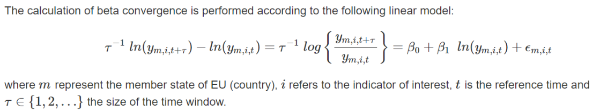

 
 
<br><br>


##  Beta convergence


Beta convergence is a catching-up process in which poorer performing countries grow faster than the best perfoming ones. The red line shows the relationship between the growth of an indicator over a certain period of time and its initial value. Beta convergence exists if that relation is statistically significant and negative. Its coefficient gives an indication of the speed of the process.
 
<br><br> 

 
<br>


<br>
```{r,echo=FALSE,fig.width=6}

betaRes <- beta_conv(tavDes = wkDF2, time_0 = ptime_0, time_t = ptime_t, 
                 all_within = FALSE, timeName = timeName,useTau=TRUE, useCon=FALSE)
# Check out with convergeEU team at Eurofound 
if(betaRes$res$beta1 > 0 && params$indiType == 'highBest'){
   diagnosis <- 'divergence'
}else if(betaRes$res$beta1 <= 0 && params$indiType == 'highBest'){
  diagnosis <- 'convergence'
}else if(betaRes$res$beta1 > 0 && params$indiType == 'lowBest'){
   diagnosis <-'divergence'
}else if(betaRes$res$beta1 <= 0 && params$indiType == 'lowBest'){
   diagnosis <- 'convergence'
}else{
  diagnosis <- 'unassigned'
} 

lastRowAverages <- nrow(outMed)

out_packed_list$betaSummary <-  list(
  indicatorType= params$indiType,
  betaCoeff = betaRes$res$beta1,
  diagnosis= diagnosis,
  startingYear = ptime_0,
  endingYear = ptime_t,
  startingAverage = as.numeric(outMed[1,aggregation]),
  endingAverage = as.numeric(outMed[lastRowAverages,aggregation]),
  DeltaAverage =  as.numeric(outMed[lastRowAverages,aggregation])-
                   as.numeric(outMed[1,aggregation])
  
)

beta_conv_gr1 <- qplot(betaRes$res$workTB$indic,
      betaRes$res$workTB$deltaIndic,
      xlab= paste("Log ",indiName ),
      ylab= paste("Log growth:",ptime_0,"-",ptime_t)) +
  geom_abline(intercept = as.numeric(betaRes$res$summary[1,2]),
              slope = as.numeric(betaRes$res$summary[2,2]),
              colour = "red") +
  geom_text(aes(label=betaRes$res$workTB$countries),
            hjust=0, vjust=0,colour="blue")
# export
out_packed_list$beta_conv_gr1 <-  beta_conv_gr1

# plot
beta_conv_gr1
```


<br>

```{r,echo = FALSE}
sigCores <- sigma_conv(wkDF2, 
                       timeName = timeName, 
                       time_0 = ptime_0, 
                       time_t=ptime_t)
#sigCores
lastRowAveragesSig <- nrow(sigCores$res)

sd_enne <<- function(vec_obs){
   enne <-  length(vec_obs)
   esse_n <- sd(vec_obs)*sqrt((enne-1)/enne)
   esse_n
}
dichia_con_stddev <- upDo_CoDi(wkDF2,
          timeName = timeName,
          indiType = params$indiType,
          time_0 = ptime_0,
          time_t = ptime_t,
          heter_fun = "sd_enne"
          )


# here stddev
if(dichia_con_stddev$res$declaration_strict != "none"){
  label_dichia_con_stddev <- paste(
       dichia_con_stddev$res$declaration_strict,
       dichia_con_stddev$res$declaration_type
       )
}else{
  label_dichia_con_stddev <- paste(
               dichia_con_stddev$res$declaration_weak,
               dichia_con_stddev$res$declaration_type
               )
}

```


 
 

Beta summary list:   

* Indicator type: `r params$indiType`    
<br>
* Beta Coefficient: `r betaRes$res$beta1`  
<br>
* Change in average:    
  
  + Year `r ptime_0`, average:  `r as.numeric(outMed[1,aggregation])`   
  + Year `r ptime_t`, average:  `r as.numeric(outMed[lastRowAverages,aggregation])`     
  + Difference $\Delta$ between years: `r as.numeric(outMed[lastRowAverages,aggregation])-as.numeric(outMed[1,aggregation])`     
<br>  

  * Results for year `r ptime_t` with reference year `r ptime_0`:    
  
      + For beta convergence:  **`r  diagnosis`**     
     
     

           
<br> 
 


               


