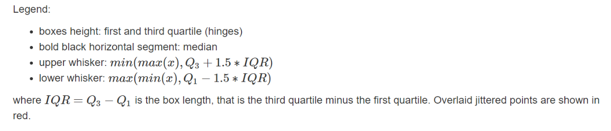

 

```{r setup, include=FALSE,eval=TRUE}

library(convergEU)
library(knitr)
library(tibble)
library(devtools)
library(tidyverse)
library(eurostat)
library(purrr)
library(ggplot2)
library(dplyr)
library(tidyr)
library(ggplot2)
options(kableExtra.auto_format = FALSE)
library(kableExtra)
library(caTools)
library(broom)
library(gridExtra)
library(flextable)
library(flexmix)
library(officer)
library(leaflet)
library(magrittr)
library(leaflet.extras)
library(cowplot)
library(png)
library(htmltools)
library(htmlwidgets)
library(webshot)
 
knitr::opts_chunk$set(
  collapse = TRUE,
  comment = "#>",
  prompt= TRUE,
  fig.width = 7,
  fig.height = 5,
  echo=FALSE,
  message = FALSE,
  warning = FALSE,
  eval=TRUE
)
```


 


```{r chunk1,eval=F}

# input parameters
params <- list()
params$dataNow <- Sys.Date()
params$time_0 <- 2008
params$time_t <- 2018
params$timeName  <- 'time'
params$workingDF  <- 'emp_20_64_MS'
params$indicaT <- 'emp_20_64_MS'
params$indiType<- 'lowBest' # highBest
params$seleMeasure <- 'all'
params$seleAggre <- 'EU12'
params$x_angle<- 45
params$data_res_download <- TRUE
params$auth <- 'A.P.Student'
params$outFile <- "test_indica-fi-cust"
# params$outDir <-
params$outDir <-   "../tt-fish"
params$pdf_out <- TRUE
params$workTB <- emp_20_64_MS
params$memStates <- 'quintiles'
```


<br>
<!-- center -->

<!-- /center -->
<br><br>

<!--
<style  type="text/css">
body {
  font-size: 38px;
}
</style
-->


# Indicator  Fiche     

This fiche shows the investigation of upward convergence of Member States in the selected indicator using the methodological framework of Eurofound (2018). Where upward convergence is the process in which Member States improve their performance in relation to a particular outcome or policy objective together with a decrease in disparities among them. From a methodological point of view, there is no single measure capable of capturing all the relevant aspects of the convergence, it is therefore essential to consider more than one measure in order to obtain a more comprehensive idea of the convergence dynamics.

<br>

### Fiche info 

   
Today: `r params$dataNow`     
R Package: <a href='https://cran.r-project.org/package=convergEU'> **convergEU** </a>  
Indicator: *`r params$indicaT`*  
Indicator type: *`r params$indiType`*  
Measures of convergence: *`r if(is.null(params$seleMeasure)){"none"}else{params$seleMeasure}`*   
Aggregation: *`r params$seleAggre`*    
Time window: *`r  params$timeName`*  from *`r as.numeric(params$time_0)`*  to *`r as.numeric(params$time_t)`*  
Author: *`r params$auth`* 

   
   
    

```{r chunk2,echo=F,eval=T}
# to save into a out-file
out_packed_list <- list()
out_packed_list$params <- params

timeName <- params$timeName
myx_angle <-  params$x_angle
ptime_0 <-  as.numeric(params$time_0)
ptime_t <-  as.numeric(params$time_t)
indiName <- indicaT <- params$indicaT
indiType <- params$indiType

#otherCountries
aggregation <- params$seleAggre 

out_packed_name <- file.path(params$outDir,
                             paste0(params$outFile,
                                    '-workspace.RData'))

 
wkDF <- params$workTB
 
# wkDF
# filtering
wkDF1 <- dplyr::filter(wkDF, .data[[timeName]] <= ptime_t & .data[[timeName]] >= ptime_0)


## select variables-countries according to aggregation
if( !(params$seleAggre %in% 
      c(convergEU_glb()$labels_clusters ,"custom"))){
  stop("Error: wrong aggregation selected!!\nLook into convergEU_glb()");
}; 

if(params$seleAggre != "custom"){
    nomiSele <- c(params$timeName,
               convergEU_glb()[[params$seleAggre]]$memberStates$codeMS)
    wkDF2 <-  wkDF1[, nomiSele]
    # only countries
    sele_soli_ms <- convergEU_glb()[[params$seleAggre]]$memberStates$codeMS

}else{
   # this is for "custom" selection
   nomiSele <- names(wkDF1)
   wkDF2 <-  wkDF1
   # only countries
   sele_soli_ms <- setdiff(names(wkDF2),timeName)
}


tempo_val <- unlist(wkDF2[,sele_soli_ms])
tempo_val <- tempo_val[tempo_val > 0]
minim_not_null <- min(tempo_val)/100
if(all(wkDF2[,sele_soli_ms] >= 0)){
      for(auxvv in sele_soli_ms){
         estrattore_nulli <- wkDF2[[auxvv]] == 0
         wkDF2[[auxvv]][estrattore_nulli] <- minim_not_null
      }
}

## selection of measures
allMeasures <- c( "beta","delta","gamma","sigma", "all")
semaforo <- list()
if(length(setdiff(params$seleMeasure, allMeasures)) > 0 ){
  stop("Errore: wrong measures selected!!")
}else{
    for(auxSemaforo in allMeasures[-5]){semaforo[[auxSemaforo]]<- FALSE};
    if("all" %in% params$seleMeasure){
       for(auxSemaforo in allMeasures[-5])semaforo[[auxSemaforo]]<- TRUE;
    }else{  
       for(auxSemaforo in params$seleMeasure)semaforo[[auxSemaforo]]<- TRUE;
    }  
}

# averaging conditional to aggregation
if(params$seleAggre != "custom"){
outMed <- average_clust(wkDF2, timeName = params$timeName, 
                        cluster = aggregation)$res[,c(timeName,aggregation)]
}else{
  outMed <- average_clust(wkDF2, timeName = params$timeName, 
                          cluster = "all")$res[,c(timeName,"all")]
  
  vars2rename <- c(custom="all")
  outMed <- dplyr::rename(outMed, custom = all)
}


## 2019-12-12 moved here
lastRowAverages <- nrow(outMed)
```
  
  
  
```{r chunk3,eval=FALSE}
print(out_packed_name)
```


  
 
 
 
 
 
 
 
```{r sigmaconvCalculations,echo = FALSE}
##
##
## Sigma convergence calculated always whether printed or not
## 2019-12-12
##


sigCores <- sigma_conv(wkDF2, timeName = timeName, time_0 = ptime_0, time_t=ptime_t)
#sigCores
lastRowAveragesSig <- nrow(sigCores$res)

sd_enne <<- function(vec_obs){
   enne <-  length(vec_obs)
   esse_n <- sd(vec_obs)*sqrt((enne-1)/enne)
   esse_n
}
CV_enne <<- function(vec_obs){
   enne <-  length(vec_obs)
   std_dev <- sd_enne(vec_obs) 
   val_CV_n <- 100*std_dev /mean(vec_obs)
   val_CV_n
}
dichia_con_stddev <- upDo_CoDi(wkDF2,
          timeName = timeName,
          indiType = params$indiType,
          time_0 = ptime_0,
          time_t = ptime_t,
          heter_fun = "sd_enne"
          )

dichia_con_CV <- upDo_CoDi(wkDF2,
          timeName = timeName,
          indiType = params$indiType,
          time_0 = ptime_0,
          time_t = ptime_t,
          heter_fun = "CV_enne"
          )


# here stddev
if(dichia_con_stddev$res$declaration_strict != "none"){
  label_dichia_con_stddev <- paste(
       dichia_con_stddev$res$declaration_strict,
       dichia_con_stddev$res$declaration_type
       )
}else{
  label_dichia_con_stddev <- paste(
               dichia_con_stddev$res$declaration_weak,
               dichia_con_stddev$res$declaration_type
               )
}
# now CV
if(dichia_con_CV$res$declaration_strict != "none"){
  label_dichia_con_CV <- paste(
       dichia_con_CV$res$declaration_strict,
       dichia_con_CV$res$declaration_type
       )
}else{
  label_dichia_con_CV <- paste(
               dichia_con_CV$res$declaration_weak,
               dichia_con_CV$res$declaration_type
               )
}

```


```{r overallSigmaConvergence,echo=FALSE}
# overall sigma convergence
diffeSTDdev <- as.numeric(sigCores$res[lastRowAverages,'stdDev'])-as.numeric(sigCores$res[1,'stdDev'])
diffeCV <- 100*(as.numeric(sigCores$res[lastRowAveragesSig,'CV'])-as.numeric(sigCores$res[1,'CV']))
if(diffeSTDdev < 0){
   label_sigmaSTDdev <- "convergence"
}else if(diffeSTDdev == 0) {
  label_sigmaSTDdev <- "unchanged"
}else{
  label_sigmaSTDdev <- "divergence"
}
if(diffeCV < 0){
   label_sigmaCV <- "convergence"
}else if(diffeCV == 0){
  label_sigmaCV <- "unchanged"
}else{
  label_sigmaCV <- "divergence"
}

label_sigma_joint<- paste("Standard Deviation: ",label_sigmaSTDdev,"; CV: ",label_sigmaCV)

```    

  


 
 
 
 
<br><br>

###  Time series overview of EU countries

The graph shows the times series trend of each Member State giving an idea of the development of the countries across time. 

<br>


<br>
```{r fig.width=6,fig.height=5}
colMS <- setdiff(names(wkDF2),timeName)

wkDF3 <-  wkDF2  %>% tidyr::gather(key = "Country",value="Indicator", colMS )
    

mGallEU <- ggplot2::ggplot(wkDF3,aes(x = time, y= Indicator, 
                                      group=Country
                                     )) +
           ggplot2::geom_line( aes(color=Country)) +
           ggplot2::scale_x_continuous(
               breaks = seq(ptime_0,ptime_t),
               labels = seq(ptime_0,ptime_t)) +
          ggplot2::theme( 
                   axis.text.x=ggplot2::element_text(
                   angle = 45 ,
                   vjust = 1,
                   hjust=1)) +
         ggplot2::ylab(indicaT) 

out_packed_list$allEUms <-  list()
out_packed_list$allEUms$mGallEU <- mGallEU

mGallEU
```
 
 
 
 

<br><br>

###  Time series summary of EU countries 

 The graph gives an overview of the development in some basic descriptive statistics: unweighted average, median, the minimum and the maximum value in each year.

<br>

<br>
```{r fig.width=6,fig.height=5}
colMS <- setdiff(names(wkDF2),timeName)

enneC <- nrow(wkDF2)
riaSD <- apply(wkDF2[,colMS],1,function(vx)sqrt(var(vx)*(enneC-1)/enneC))
sintesiTB <- wkDF2[,timeName]
sintesiTB <- sintesiTB %>% 
    dplyr::mutate(min =apply(wkDF2[,colMS],1,min))%>%
    dplyr::mutate(max = apply(wkDF2[,colMS],1,max))%>%
    dplyr::mutate(mean = apply(wkDF2[,colMS],1,mean))%>%
    dplyr::mutate(median = apply(wkDF2[,colMS],1,median))%>%
    dplyr::mutate(mean_mSD =mean-riaSD)%>%
    dplyr::mutate(mean_pSD =mean+riaSD)
  
  
riaFlat<-  sintesiTB  %>% tidyr::gather( key = "Stat",
                value="Value",c("min", "mean_mSD", "mean", "median",
                                "mean_pSD","max"), 
                 )
riaFlat$Stat <- factor(riaFlat$Stat,
                       levels= c("min", "mean_mSD", "mean", "median",
                                "mean_pSD","max"))
myStyle <-  c("solid", "dashed", "dotted", "dotdash", "longdash", "twodash")
myColors <- c("black","black","white","red","blue","blue")
riaFlat <- dplyr::mutate(riaFlat,LineType = 0)    
riaFlat$LineType[riaFlat$Stat == "median"] <- 3    
riaFlat$LineType[riaFlat$Stat == "mean"] <- 1
riaFlat$LineType[riaFlat$Stat == "median"] <- 2     
riaFlat$LineType[riaFlat$Stat == "mean_mSD"] <- 4     
riaFlat$LineType[riaFlat$Stat == "mean_pSD"] <- 4    
riaFlat$LineType[riaFlat$Stat == "min"] <- 5     
riaFlat$LineType[riaFlat$Stat == "max"] <- 5     
riaFlat<- mutate(riaFlat,Grp= as.numeric(factor(Stat)))
# for legend
riaFlat <- dplyr::mutate(riaFlat,mylty=myStyle[riaFlat$LineType])
riaFlat <- dplyr::mutate(riaFlat,Statistic=as.character(riaFlat$Stat))


myLabels <- c("max", "mean","mean_mSD","mean_pSD","median","min")
# build labels for minimum and maximum

sintesiTB$eticheMin <- sapply(seq(1,length(sintesiTB$min)),
      function(vx){
      estrattore <- sintesiTB$min[vx] == wkDF2[vx,colMS]
      #print(sum(estrattore))
      paste(colMS[estrattore],collapse="/")
})
sintesiTB$eticheMax <- sapply(seq(1,length(sintesiTB$max)),
      function(vx){
      estrattore <- sintesiTB$max[vx] == wkDF2[vx,colMS]
      #print(sum(estrattore))
      paste(colMS[estrattore],collapse="/")
}) 


mGallSummary <- ggplot2::ggplot(riaFlat,aes(x = time,y= Value)) +
  ggplot2::geom_line( aes( colour=Stat ),linetype=riaFlat$mylty) +
  ggplot2::geom_point( aes( colour=Stat)) +
  scale_colour_manual("Statistic",values=c(min="blue",
                               mean_mSD="red",
                               mean="black",
                               median="black",
                               mean_pSD = "red",
                               max="blue")
                      ,labels=c(min="min",
                               mean_mSD="mean-1*std.dev.",
                               mean="mean",
                               median="median",
                               mean_pSD = "mean+1*std.dev.",
                               max="max")
                      ) +
  guides(shape = "none", colour = guide_legend(
           override.aes = list(linetype =  c("min"="82",
                                        "mean_mSD"="3313",
                                        "mean"="F1",
                                        "median"="66",
                                        "mean_pSD" = "3313",
                                        "max"="82")
           ))) + theme(legend.key.size = unit(1.3, "cm"))  +
  ggplot2::scale_x_continuous(
    breaks = seq(ptime_0,ptime_t),
    labels = seq(ptime_0,ptime_t)) +
  ggplot2::theme(
    axis.text.x=ggplot2::element_text(
      angle = 45 ,
      vjust = 1,
      hjust=1)) +
  ggplot2::ylab(indicaT) +
  # labels on min and max
  ggplot2::annotate("text",
                    x =sintesiTB[[timeName]] ,
                    y=sintesiTB$max ,
                    label = paste(sintesiTB$eticheMax,"    "),
                    color ="navyblue",
                    angle=45) +
  ggplot2::annotate("text",
                    x =sintesiTB[[timeName]] ,
                    y=sintesiTB$min ,
                    label = paste("    ",sintesiTB$eticheMin),
                    color ="navyblue",
                    angle=45)


out_packed_list$allEUms$mGallSummary <-  mGallSummary

mGallSummary
```


<br> 
 
 
 
 
 
 
 
<br><br>

###  Boxplots of EU countries over time

The graph gives an overall idea of the dispersion and some descriptive statistics of the Member States in each year. 


<br>
```{r fig.width=6,fig.height=5}
wkDF3 <- tidyr::gather(wkDF2,key = "Country",value="Indicator",colMS)
    
wkDF3$time <-  factor(wkDF3$time)
condiBP <-   qplot(time,Indicator,data=wkDF3,geom="boxplot",
                  group= time) +
          geom_point(position=position_jitter(width=0.1),
                     colour=alpha("red",0.25)) +
          ggplot2::theme( 
                   axis.text.x=ggplot2::element_text(
                   angle = 45 ,
                   vjust = 1,
                   hjust=1)) +
         ggplot2::ylab(indicaT)


  
out_packed_list$condiBP <-  condiBP

condiBP
```
 

<br><br>
 
 
 
 
 
 
 
 
 
 
 
 
 
 
<br><br>

###  Unweighted average by year over selected countries

The graph presents the unweighted average calculated on the aggregation of Member States selected. Below the graph there are initial and final year values and the overall change in the period.
The overall change can be upward or downward depending on the objective direction of the indicator and its interpretation.

<br>

<br>
```{r,echo=FALSE, fig.width=6,fig.height=5}

cluster_mean_gr2 <- qplot(
      unlist(outMed[,timeName]),
      unlist(outMed[,aggregation]),
      xlab= paste("Years "),
      ylab= paste("Average (",aggregation,")")) +
  geom_line()  +
  ggplot2::scale_x_continuous(
       breaks = seq(ptime_0,ptime_t),
       labels = seq(ptime_0,ptime_t)) +
  ggplot2::theme( 
         axis.text.x=ggplot2::element_text(
         angle = 45 ,
         vjust = 1,
         hjust=1))
  

# export
out_packed_list$cluster_mean_gr2 <-  cluster_mean_gr2
#plot
cluster_mean_gr2
```
 
```{r,echo=FALSE}

diffeAve <- as.numeric(outMed[lastRowAverages,aggregation]) - 
            as.numeric(outMed[1,aggregation])
## highBest
if( (diffeAve > 0 )  &  (params$indiType =="highBest")){
  labelAveDelta <-  "upward change"
}else if((diffeAve == 0)  &  (params$indiType =="highBest")){
  labelAveDelta <- "unchanged"
}else if((diffeAve < 0)  &  (params$indiType =="highBest")) {
  labelAveDelta <- "downward change"
}
## lowBest
if( (diffeAve > 0 )  &  (params$indiType =="lowBest")){
  labelAveDelta <-  "downward change"
}else if((diffeAve == 0)  &  (params$indiType =="lowBest")){
  labelAveDelta <- "unchanged"
}else if((diffeAve < 0)  &  (params$indiType =="lowBest")) {
  labelAveDelta <- "upward change"
}

```


  * Change in average:    
  
      + Year `r ptime_0`, average:  `r as.numeric(outMed[1,aggregation])`   
      + Year `r ptime_t`, average:  `r as.numeric(outMed[lastRowAverages,aggregation])`         
      + Difference $\Delta$ between years: `r  diffeAve`    
   <br> 
  * Overall result (interpretation): **`r   labelAveDelta`**      
 <br>    
  * Member states with increment of mean in year `r ptime_t` with respect  to year   `r ptime_0`:   
  
      + `r  paste(sort(dichia_con_stddev$res$declaration_split$names_incre),collapse="; ")`   
      
  * Member states with decrement of means in year `r ptime_t` with respect  to year   `r ptime_0`:    
  
      + `r  paste(sort(dichia_con_stddev$res$declaration_split$names_decre),collapse="; ")`   


 

 
 
 
 
 
 
 
 
 
 
 
 
 
 
 
 
```{r,echo=FALSE,eval=TRUE}
# Pre-processing for beta convergence when null or negative values 
#     are present 

wkDF2bis <- dplyr::filter(wkDF2, .data[[timeName]] == ptime_0 | 
                                 .data[[timeName]] == ptime_t)[sele_soli_ms];  
             

semaforo[["nega_val_indi"]] <- FALSE
#nega_val <- any(wkDF2[, sele_soli_ms] < 0)# check too many values instead of ptime_t & ptime_0
nega_val <- any(wkDF2bis < 0)

if(nega_val & semaforo[["beta"]] ){
  semaforo[["nega_val_indi"]] <- TRUE
  semaforo[["beta"]] <- FALSE
}
 
```  

```{r,echo=FALSE,eval=FALSE, fig.width=5,fig.height=5}
semaforo
```
 
  

```{r,echo=FALSE,results='asis', fig.width=5,fig.height=5}
if(semaforo[["nega_val_indi"]]){
  cat(knitr::asis_output(knitr::knit_child("indica_fi_2_nobeta.Rmd", 
                                           quiet=TRUE, envir=environment())))
}
```

```{r,echo=FALSE,results='asis', fig.width=5,fig.height=5}
if(semaforo[["beta"]]){
  cat(knitr::asis_output(knitr::knit_child("indica_fi_2_beta.Rmd", 
                                           quiet=TRUE, envir=environment())))
}
```

 

          

            


        

```{r,echo=FALSE,results='asis',eval=TRUE, fig.width=5,fig.height=5}
if(semaforo[["sigma"]]){
  cat(knitr::asis_output(knitr::knit_child("indica_fi_2_sigma.Rmd", 
                                           quiet=TRUE, envir=environment())))
}
```
            
            
 


```{r,echo=FALSE,results='asis',eval=TRUE, fig.width=5,fig.height=5}
if(semaforo[["delta"]]){
  cat(knitr::asis_output(knitr::knit_child("indica_fi_2_delta.Rmd", 
                                           quiet=TRUE, envir=environment())))
}
```
    


 


```{r,echo=FALSE,results='asis',eval=TRUE, fig.width=5,fig.height=5}
if(semaforo[["gamma"]]){
  cat(knitr::asis_output(knitr::knit_child("indica_fi_2_gamma.Rmd", 
                                           quiet=TRUE, envir=environment())))
}
```

 
 


<br><br> 

## Member States dynamics


The dynamics of Member States show the differences in the situation of single
 Member States which can be hidden under the use of a single indicator.
Understanding the dynamics is also necessary to better identify possible drivers
 of convergence and divergence as well as structural deficiencies or sustainable
 recoveries.

<br><br> 


```{r,echo=FALSE}
#altezzIG0 <- 3+7*(length(sele_soli_ms)/30)

obe_lvl <- scoreb_yrs(wkDF2,timeName = timeName)$res$sco_level_num
#curCountries <- names(obe_lvl)[-1]
curCountries <- setdiff(names(obe_lvl),timeName)
altezzIG00 <- 3+7*(length(curCountries)/30)
```

```{r,echo=FALSE, fig.width=6,fig.height=5}

#Alert indicator
# create quintile function
ntile_5  <- function(x){
  ntile(x,5)
}

# create quintile grouping matrix
conv_quintile_groups <- as.data.frame(t(apply(wkDF2[,2:ncol(wkDF2)], 1, ntile_5)))

# add in time column
conv_quintile_groups <- bind_cols(wkDF2$time, conv_quintile_groups) 

# rename columns
colnames(conv_quintile_groups) <- colnames(wkDF2)
alert_indic <- conv_quintile_groups%>%
  pivot_longer(!time, names_to = "country", values_to = "quintile")
#if lowBest, cahnge output in dataset
if (params$indiType=="lowBest"){
alert_indic$quintile<-ifelse(alert_indic$quintile==1,5,ifelse(alert_indic$quintile==2,4,ifelse(alert_indic$quintile==3,3,ifelse(alert_indic$quintile==4,2,1))))
}


# create graph for alert inddicator
ggplot(alert_indic, 
       aes(x=unlist(alert_indic[,1]), 
           y=unlist(alert_indic[,3]))) + 
  facet_wrap(vars(country), ncol=5) +
  geom_point() +
  scale_x_continuous(
    breaks = unlist(alert_indic[,1]),
    labels = unlist(alert_indic[,1]))  +
  theme(axis.text.x=element_text(angle = 90)) +
  scale_y_continuous(
    breaks =  c(1, 2, 3, 4, 5),
    labels = c(1, 2, 3, 4, 5), 
    limits= c(1, 6)) +
  xlab("Time") +ylab("Quintile group") +
  theme(legend.position="none",
        strip.background=element_rect(colour="black", fill="lightblue"))+
  ggtitle("Quintile position across time")
```


```{r,echo=FALSE}

#----------MAPS------------------------------------------------------------
miniT <- min(wkDF2[,timeName])
maxiT <- max(wkDF2[,timeName])
breaks_x <- unlist(unique(wkDF2[,timeName]))
etichY  <-  names(wkDF2)[-c(1)]
names(etichY) <-  etichY
myTB2 <- tidyr::gather(wkDF2, key = "id",
                       value = "profile",etichY)
myTB2 <- dplyr::mutate(myTB2, position = rep(1:length(etichY),
                                             each=nrow(wkDF2)))
## change
myTB3 <- tidyr::gather(wkDF2, key = "id",
                       value = "profile",etichY)
myTB3$profile <- as.numeric(myTB3$profile)
myTB4 <- myTB3 %>% group_by(time) %>% 
  mutate(Cluster = ntile(profile, 5))
# df <- myTB4 %>% filter( time %in% c(maxiT,miniT))
df2 <- myTB4 %>% select(time, id, Cluster) %>% spread(time, Cluster)
df2 <- df2[,c(1,2,ncol(df2))]
#calculate change between time t0 and time t1
df2$change <- df2[3]-df2[2]
names(df2)[4]<-"change" #not sure why I can't change the column name

##this is for highBest
df2$label_t_0<-NA
df2$label_t_0<-ifelse(df2[as.character(miniT)]==1,"Cluster 1 (lagging behind)",
                        ifelse(df2[as.character(miniT)]==2,"Cluster 2",
                               ifelse(df2[as.character(miniT)]==3, "Cluster 3",
                                      ifelse(df2[as.character(miniT)]==4,"Cluster 4", "Cluster 5 (top performer)"))))

df2$label_t_1<-NA
df2$label_t_1<-ifelse(df2[as.character(maxiT)]==1,"Cluster 1 (lagging behind)",
                        ifelse(df2[as.character(maxiT)]==2,"Cluster 2",
                               ifelse(df2[as.character(maxiT)]==3, "Cluster 3",
                                      ifelse(df2[as.character(maxiT)]==4,"Cluster 4", "Cluster 5 (top performer)"))))

df2$label_change<-NA
df2$label_change<-ifelse(df2$change<=-2,"-2 clusters or more",
                           ifelse(df2$change==-1,"-1 cluster",
                                  ifelse(df2$change==0, "remained the same",
                                         ifelse(df2$change==1,"+1 cluster", "+2 clusters or more"))))
if (params$indiType=="lowBest"){
  
df2$label_t_0<-NA
df2$label_t_0<-ifelse(df2[as.character(miniT)]==5,"Cluster 1 (lagging behind)",
                        ifelse(df2[as.character(miniT)]==4,"Cluster 2",
                               ifelse(df2[as.character(miniT)]==3, "Cluster 3",
                                      ifelse(df2[as.character(miniT)]==2,"Cluster 4", "Cluster 5 (top performer)"))))

df2$label_t_1<-NA
df2$label_t_1<-ifelse(df2[as.character(maxiT)]==5,"Cluster 1 (lagging behind)",
                        ifelse(df2[as.character(maxiT)]==4,"Cluster 2",
                               ifelse(df2[as.character(maxiT)]==3, "Cluster 3",
                                      ifelse(df2[as.character(maxiT)]==2,"Cluster 4", "Cluster 5 (top performer)"))))
# df2$label_t_0<-NA
# df2$label_t_0<-ifelse(df2[as.character(miniT)]==1,"Cluster 5 (top performer)",
#                         ifelse(df2[as.character(miniT)]==2,"Cluster 4",
#                                ifelse(df2[as.character(miniT)]==3, "Cluster 3",
#                                       ifelse(df2[as.character(miniT)]==4,"Cluster 2", "Cluster 1 (lagging behind)"))))
#   df2$label_t_1<-NA
#   df2$label_t_1<-ifelse(df2[as.character(maxiT)]==1,"Cluster 5 (top performer)",
#                         ifelse(df2[as.character(maxiT)]==2,"Cluster 4",
#                                ifelse(df2[as.character(maxiT)]==3, "Cluster 3",
#                                       ifelse(df2[as.character(maxiT)]==4,"Cluster 2", "Cluster 1 (lagging behind)"))))
  df2$label_change<-NA
  df2$label_change<-ifelse(df2$change<=-2,"+2 clusters or more",
                           ifelse(df2$change==-1,"+1 cluster",
                                  ifelse(df2$change==0, "remained the same",
                                         ifelse(df2$change==1,"-1 cluster", "-2 clusters or more"))))
}


geodata_countries <- get_eurostat_geospatial(output_class = "sf", 
                                             resolution = "60", 
                                             nuts_level = "0", 
                                             year = "2016", make_valid = FALSE)  ##n get_eurostat_geospatial(output_class = "sf", resolution = "10",  :
##   Default of 'make_valid' for 'output_class="sf"' will be changed in the future (see function details).
map_data<- inner_join(geodata_countries, df2,by="id")
#
map_data$label_change<-factor(map_data$label_change,
                              levels=c("-2 clusters or more",
                                       "-1 cluster",
                                       "remained the same",
                                       "+1 cluster",
                                       "+2 clusters or more"))
```


<br>

<br>
```{r,echo=FALSE,fig.width=5,fig.height=5, out.width="90%"}
factpal <- colorFactor("RdYlGn", map_data$label_t_0)

tag.map.title <- tags$style(HTML("
  .leaflet-control.map-title { 
    transform: translate(-50%,20%);
    position: fixed !important;
    left: 40%;
    text-align: center;
    padding-left: 10px; 
    padding-right: 10px; 
    background: rgba(255,255,255,0.75);
    font-weight: bold;
    font-size: 28px;
  }
"))

title <- tags$div(
  tag.map.title, HTML("Indicator value in ", paste(ptime_0))
)

  
#===========MAP_t_0==================================
map_t_0 <- leaflet(map_data) %>%
  #addProviderTiles("CartoDB.Positron") %>%
  addPolygons(fill=TRUE,
              fillColor = ~factpal(label_t_0),
              fillOpacity = 0.8,
              opacity=0.1,
              color = "black",
              label= paste(map_data$CNTR_CODE,map_data$label_t_0, sep=" "),
              weight = 1,
              stroke = TRUE,
              highlight = highlightOptions(weight = 5,  color = "black", fillOpacity = 1,bringToFront = TRUE)) %>%
	      addTiles(urlTemplate = "", attribution = paste0("Shapefile source: \U00A9 Eurostat")) %>%
  setView(10,56.8, zoom=3.5) %>%  #set view on EU
  setMapWidgetStyle(list(background= "white"))%>%
  addLegend(position = c("topleft"),
            pal=factpal,
            values=map_data$label_t_0,
            na.label = "NA",
            opacity = 0.5,
            labFormat = labelFormat(),
            className = "info legend",
  ) %>%
  addControl(title, position = "topleft", className="map-title")

out_packed_list$map_t_0 <- map_t_0
  
## save html to png
saveWidget(map_t_0, "temp0.html", selfcontained = FALSE)
webshot("temp0.html", file = "map_t_0.png",
        cliprect = "viewport")
  

out_packed_list$map_t_0 <- map_t_0

```

```{r echo=FALSE,fig.width=5,fig.height=5, out.width="90%"} 
map0 <- "map_t_0.png"
# include_graphics(map0)
```

<br>

<br>
```{r,echo=FALSE,fig.width=5,fig.height=5, out.width="90%"}

tag.map.title <- tags$style(HTML("
  .leaflet-control.map-title { 
    transform: translate(-50%,20%);
    position: fixed !important;
    left: 40%;
    text-align: center;
    padding-left: 10px; 
    padding-right: 10px; 
    background: rgba(255,255,255,0.75);
    font-weight: bold;
    font-size: 28px;
  }
"))

title <- tags$div(
  tag.map.title, HTML("Indicator value in ", paste(ptime_t))
)

#===========MAP_t_1==================================
  factpal1 <- colorFactor("RdYlGn", map_data$label_t_1)
  
  map_t_1<-leaflet(map_data) %>% 
    #addProviderTiles("CartoDB.Positron") %>%
    addPolygons(fill=TRUE,
                fillColor = ~factpal1(label_t_1),
                fillOpacity = 0.8, 
                opacity=0.1, 
                color = "black",
                label= paste(map_data$CNTR_CODE,map_data$label_t_1,sep=" "),
                weight = 1,
                stroke = TRUE,
                highlight = highlightOptions(weight = 5,  color = "black", fillOpacity = 1,bringToFront = TRUE)) %>%
    addTiles(urlTemplate = "", attribution = paste0("Shapefile source: \U00A9 Eurostat")) %>%
  setView(10,56.8, zoom=3.5) %>%  #set view on EU
    setMapWidgetStyle(list(background= "white")) %>%
    addLegend(position = c("topleft"),
              pal=factpal1,
              values=map_data$label_t_1,
              na.label = "NA",
              opacity = 0.5,
              labFormat = labelFormat(),
              className = "info legend",
    ) %>%
    addControl(title, position = "topleft", className="map-title")
  
  
out_packed_list$map_t_1 <- map_t_1
  
#map_t_1
## save html to png
saveWidget(map_t_1, "temp1.html", selfcontained = FALSE)
webshot("temp1.html", file = "map_t_1.png",
        cliprect = "viewport")

```

```{r echo=FALSE,fig.width=5,fig.height=5, out.width="90%"} 
map1 <- "map_t_1.png"
# include_graphics(map1)
```


<br>

<br>
```{r,echo=FALSE,fig.width=5,fig.height=5, out.width="90%"}

tag.map.title <- tags$style(HTML("
  .leaflet-control.map-title { 
    transform: translate(-50%,20%);
    position: fixed !important;
    left: 20%;
    text-align: center;
    padding-left: 10px; 
    padding-right: 10px; 
    background: rgba(255,255,255,0.75);
    font-weight: bold;
    font-size: 28px;
  }
"))

title <- tags$div(
  tag.map.title, HTML("Change: ",paste(ptime_t),"and",paste(ptime_0)))

#===========MAP_change==================================
#rgb(230, 97, 1)orange
#rgb(253,184,99)light orange
#ivory -ivory
#rgb(146,197,222) light blue
#rgb(53,132,172) darker blue - added

palette_change <- colorFactor(palette=c(rgb(230,97,1, maxColorValue = 255), #red-orange
                                        rgb(253,184,99, maxColorValue = 255), #light orange
                                        rgb(255,255,240, maxColorValue = 255), #ivory
                                        rgb(146,197,222, maxColorValue = 255), #lighter blue
                                        rgb(53,132,172, maxColorValue = 255)), #darker blue
                                        map_data$label_change)

map_change<-leaflet(map_data) %>% 
  #addProviderTiles("CartoDB.Positron") %>%
  addPolygons(fill=TRUE,
              fillColor = ~palette_change(map_data$label_change),
              fillOpacity = 0.8, 
              opacity=0.1, 
              color = "black" ,
              label= paste(map_data$CNTR_CODE,map_data$label_change,sep=" "),
              weight = 1,
              stroke = TRUE,
              highlight = highlightOptions(weight = 5,  color = "black", fillOpacity = 1,bringToFront = TRUE)) %>%
  addTiles(urlTemplate = "", attribution = paste0("Shapefile source: \U00A9 Eurostat")) %>%
  setView(10,56.8, zoom=3.5) %>%  #set view on EU
  setMapWidgetStyle(list(background= "white")) %>%
  addLegend(position = c("topleft"),
            pal=palette_change,
            values=map_data$label_change,
            na.label = "NA",
            opacity = 0.5,
            labFormat = labelFormat(),
            className = "info legend",
  ) %>%
  addControl(title, position = "topleft", className="map-title")

## save html to png
saveWidget(map_change, "temp2.html", selfcontained = FALSE)
webshot("temp2.html", file = "map_change.png",
        cliprect = "viewport")

out_packed_list$map_change <- map_change
#map_change
```


```{r echo=FALSE,fig.width=5,fig.height=5, out.width="90%"} 
map2 <- "map_change.png"
# include_graphics(map2)
```


*These maps show the statistical values per countries.  
 
 
 
 
 


<br><br>

#### Convergence and divergence patterns 


The table represents  convergence patterns of the 'aggregation' countries
 in the chosen time frame. The values in the table refer to the patterns shown in the
 graphical legend below.


 

<style>
.vertical-text {
	display: inline-block;
	overflow: hidden;
	width: 1.3em;
}
.vertical-text__inner {
	display: inline-block;
	white-space: nowrap;
	line-height: 1.5;
	transform: translate(0,100%) rotate(-90deg);
	transform-origin: 0 0;
}
/* This element stretches the parent to be square
   by using the mechanics of vertical margins  */
.vertical-text__inner:after {
	content: "";
	display: block;
	margin: -1.5em 0 100%;
}


body {
	font: 11px/1 Arial, sans-serif;
}

table {
	margin-top: 1em;
}
th,td {
	border: 1px solid;
	text-align:center;
	font-weight: normal;
	padding: 0.5em;
}
head{
   color: blue;
}
</style>


 
 

<br> 
```{r,echo=FALSE,results='hide',fig.keep='all',fig.width=6}
estrattore <- as.logical((wkDF2[,timeName] >= ptime_0) &  (wkDF2[,timeName]<= ptime_t))
estrattore_1_n <- as.logical((wkDF2[,timeName] == ptime_0) |  (wkDF2[,timeName]== ptime_t))

# original code pre 39 patterns
# myMSPat <- ms_pattern_ori(wkDF2[estrattore,],
#                           timeName = timeName,
#                           typeIn= params$indiType)
# myMSPat_first_last <- ms_pattern_ori(wkDF2[estrattore_1_n ,],
#                           timeName = timeName,
#                           typeIn= params$indiType)
# end original code
### new 39+1 patterns
myMSPat <- ms_pattern_59(wkDF2[estrattore,],
                          timeName = timeName)
myMSPat_first_last <- ms_pattern_59(wkDF2[estrattore_1_n ,],
                          timeName = timeName)
## end of 39+1 new patterns


workMatSco <- myMSPat$res$mat_num_tags
workMatSco2 <- dplyr::bind_cols(myMSPat$res$mat_num_tags,
                            myMSPat_first_last$res$mat_num_tags[,2] )
# test
if(any(myMSPat$res$mat_num_tags[,1] != myMSPat_first_last$res$mat_num_tags[,1])){
  stop("Error: line 1020 indica_fi.Rmd - countries do not match.")
}


curCountries <- setdiff(names(wkDF2),timeName)
posiMS <- posiMS2 <- vector()
for(auxCC in curCountries){
    posiMS <-  c(posiMS,which(workMatSco$Country == auxCC))
    posiMS2 <-  c(posiMS2,which(workMatSco2$Country == auxCC))
    
}  
workMatSco <- workMatSco[posiMS,]
workMatSco2 <- workMatSco2[posiMS2,]
  

if(aggregation != "custom"){
  map2str <- convergEU_glb()[[aggregation]]$memberStates
}else{ # it's custom 3 october 2019
  map2str <- dplyr::tibble(MS = curCountries,
                           codeMS = curCountries)
}


## below is fine
for(aux in 1:nrow(workMatSco)){ 
    puntaMS <- which(map2str$codeMS ==   workMatSco$Country[aux ])
    workMatSco$Country[aux ] <- map2str$MS[puntaMS]
    puntaMS2 <- which(map2str$codeMS ==   workMatSco2$Country[aux ])
    workMatSco2$Country[aux ] <- map2str$MS[puntaMS]
    
}
## indicate 59 patterns
color_ind1 <- which(workMatSco2 == 1, arr.ind = TRUE)
color_ind2 <- which(workMatSco2 == 2, arr.ind = TRUE)
color_ind3 <- which(workMatSco2 == 3, arr.ind = TRUE)
color_ind4 <- which(workMatSco2 == 4, arr.ind = TRUE)
color_ind5 <- which(workMatSco2 == 5, arr.ind = TRUE)
color_ind6 <- which(workMatSco2 == 6, arr.ind = TRUE)
color_ind7 <- which(workMatSco2 == 7, arr.ind = TRUE)
color_ind8 <- which(workMatSco2 == 8, arr.ind = TRUE)
color_ind9 <- which(workMatSco2 == 9, arr.ind = TRUE)
color_ind10 <- which(workMatSco2 == 10, arr.ind = TRUE)
color_ind11 <- which(workMatSco2 == 11, arr.ind = TRUE)
color_ind12 <- which(workMatSco2 == 12, arr.ind = TRUE)
color_ind13 <- which(workMatSco2 == 13, arr.ind = TRUE)
color_ind14 <- which(workMatSco2 == 14, arr.ind = TRUE)
color_ind15 <- which(workMatSco2 == 15, arr.ind = TRUE)
color_ind16 <- which(workMatSco2 == 16, arr.ind = TRUE)
color_ind17 <- which(workMatSco2 == 17, arr.ind = TRUE)
color_ind18 <- which(workMatSco2 == 18, arr.ind = TRUE)
color_ind19 <- which(workMatSco2 == 19, arr.ind = TRUE)
color_ind20 <- which(workMatSco2 == 20, arr.ind = TRUE)
color_ind21 <- which(workMatSco2 == 21, arr.ind = TRUE)
color_ind22 <- which(workMatSco2 == 22, arr.ind = TRUE)
color_ind23 <- which(workMatSco2 == 23, arr.ind = TRUE)
color_ind24 <- which(workMatSco2 == 24, arr.ind = TRUE)
color_ind25 <- which(workMatSco2 == 25, arr.ind = TRUE)
color_ind26 <- which(workMatSco2 == 26, arr.ind = TRUE)
color_ind27 <- which(workMatSco2 == 27, arr.ind = TRUE)
color_ind28 <- which(workMatSco2 == 28, arr.ind = TRUE)
color_ind29 <- which(workMatSco2 == 29, arr.ind = TRUE)
color_ind30 <- which(workMatSco2 == 30, arr.ind = TRUE)
color_ind31 <- which(workMatSco2 == 31, arr.ind = TRUE)
color_ind32 <- which(workMatSco2 == 32, arr.ind = TRUE)
color_ind33 <- which(workMatSco2 == 33, arr.ind = TRUE)
color_ind34 <- which(workMatSco2 == 34, arr.ind = TRUE)
color_ind35 <- which(workMatSco2 == 35, arr.ind = TRUE)
color_ind36 <- which(workMatSco2 == 36, arr.ind = TRUE)
color_ind37 <- which(workMatSco2 == 37, arr.ind = TRUE)
color_ind38 <- which(workMatSco2 == 38, arr.ind = TRUE)
color_ind39 <- which(workMatSco2 == 39, arr.ind = TRUE)
color_ind40 <- which(workMatSco2 == 40, arr.ind = TRUE)
color_ind41 <- which(workMatSco2 == 41, arr.ind = TRUE)
color_ind42 <- which(workMatSco2 == 42, arr.ind = TRUE)
color_ind43 <- which(workMatSco2 == 43, arr.ind = TRUE)
color_ind44 <- which(workMatSco2 == 44, arr.ind = TRUE)
color_ind45 <- which(workMatSco2 == 45, arr.ind = TRUE)
color_ind46 <- which(workMatSco2 == 46, arr.ind = TRUE)
color_ind47 <- which(workMatSco2 == 47, arr.ind = TRUE)
color_ind48 <- which(workMatSco2 == 48, arr.ind = TRUE)
color_ind49 <- which(workMatSco2 == 49, arr.ind = TRUE)
color_ind50 <- which(workMatSco2 == 50, arr.ind = TRUE)
color_ind51 <- which(workMatSco2 == 51, arr.ind = TRUE)
color_ind52 <- which(workMatSco2 == 52, arr.ind = TRUE)
color_ind53 <- which(workMatSco2 == 53, arr.ind = TRUE)
color_ind54 <- which(workMatSco2 == 54, arr.ind = TRUE)
color_ind55 <- which(workMatSco2 == 55, arr.ind = TRUE)
color_ind56 <- which(workMatSco2 == 56, arr.ind = TRUE)
color_ind57 <- which(workMatSco2 == 57, arr.ind = TRUE)
color_ind58 <- which(workMatSco2 == 58, arr.ind = TRUE)
color_ind59 <- which(workMatSco2 == 59, arr.ind = TRUE)
color_ind60 <- which(workMatSco2 == 60, arr.ind = TRUE)

bcolor_ind_high1 <- which(workMatSco2 == 1, arr.ind = TRUE)
bcolor_ind_high2 <- which(workMatSco2 == 2, arr.ind = TRUE)
bcolor_ind_high3 <- which(workMatSco2 == 3, arr.ind = TRUE)
bcolor_ind_high4 <- which(workMatSco2 == 4, arr.ind = TRUE)
bcolor_ind_high5 <- which(workMatSco2 == 39, arr.ind = TRUE)
bcolor_ind_high6 <- which(workMatSco2 == 40, arr.ind = TRUE)
bcolor_ind_high7 <- which(workMatSco2 == 37, arr.ind = TRUE)
bcolor_ind_high8 <- which(workMatSco2 == 38, arr.ind = TRUE)

bcolor_ind_low1 <- which(workMatSco2 == 17, arr.ind = TRUE)
bcolor_ind_low2 <- which(workMatSco2 == 20, arr.ind = TRUE)
bcolor_ind_low3 <- which(workMatSco2 == 18, arr.ind = TRUE)
bcolor_ind_low4 <- which(workMatSco2 == 19, arr.ind = TRUE)
bcolor_ind_low5 <- which(workMatSco2 == 21, arr.ind = TRUE)
bcolor_ind_low6 <- which(workMatSco2 == 22, arr.ind = TRUE)
bcolor_ind_low7 <- which(workMatSco2 == 23, arr.ind = TRUE)
bcolor_ind_low8 <- which(workMatSco2 == 24, arr.ind = TRUE)


#flextable aka flx2

# #if statement to display table when yeasrs perido id >20
# if (ncol(workMatSco2)>5){
#   aff<-ncol(workMatSco2)
#   workMatSco2<-workMatSco2[1,c(2,aff)]
# }

#change countryname to acronym
workMatSco2$Country[workMatSco2$Country=='Belgium']<-'BE'
workMatSco2$Country[workMatSco2$Country=='Denmark']<-'DK'
workMatSco2$Country[workMatSco2$Country=='France']<-'FR'
workMatSco2$Country[workMatSco2$Country=='Germany']<-'DE'
workMatSco2$Country[workMatSco2$Country=='Greece']<-'EL'
workMatSco2$Country[workMatSco2$Country=='Ireland']<-'IE'
workMatSco2$Country[workMatSco2$Country=='Italy']<-'IT'
workMatSco2$Country[workMatSco2$Country=='Luxembourg']<-'LU'
workMatSco2$Country[workMatSco2$Country=='Netherlands']<-'NL'
workMatSco2$Country[workMatSco2$Country=='Portugal']<-'PT'
workMatSco2$Country[workMatSco2$Country=='Spain']<-'ES'
workMatSco2$Country[workMatSco2$Country=='United-Kingdom']<-'UK'
workMatSco2$Country[workMatSco2$Country=='Austria']<-'AT'
workMatSco2$Country[workMatSco2$Country=='Finland']<-'FI'
workMatSco2$Country[workMatSco2$Country=='Sweden']<-'SE'
workMatSco2$Country[workMatSco2$Country=='Cyprus']<-'CY'
workMatSco2$Country[workMatSco2$Country=='Czechia']<-'CZ'
workMatSco2$Country[workMatSco2$Country=='Estonia']<-'EE'
workMatSco2$Country[workMatSco2$Country=='Hungary']<-'HU'
workMatSco2$Country[workMatSco2$Country=='Latvia']<-'LV'
workMatSco2$Country[workMatSco2$Country=='Lithuania']<-'LT'
workMatSco2$Country[workMatSco2$Country=='Malta']<-'MT'
workMatSco2$Country[workMatSco2$Country=='Poland']<-'PL'
workMatSco2$Country[workMatSco2$Country=='Slovakia']<-'SK'
workMatSco2$Country[workMatSco2$Country=='Slovenia']<-'SI'
workMatSco2$Country[workMatSco2$Country=='Bulgaria']<-'BG'
workMatSco2$Country[workMatSco2$Country=='Romania']<-'RO'
workMatSco2$Country[workMatSco2$Country=='Croatia']<-'HR'


flx2 <- autofit(flextable(workMatSco2))
flx2 <- rotate(flx2,j = 1:(ncol(workMatSco2)-1), rotation="btlr",part="header")
flx2 <- rotate(flx2,j = ncol(workMatSco2), rotation="btlr",part="header")
flx2 <- add_header_row(flx2, values = c("", "Yearly Changes",""), colwidths = c(1,(ncol(workMatSco2)-2),1))
flx2 <- bold(flx2,bold=TRUE, part="header")
flx2 <- color(flx2,color="#2676ba", part = "header")
flx2 <- hline(flx2, part="body",border = fp_border(color="gray"))
flx2 <- vline(flx2, j=1,border = fp_border(color = "black", style = "solid", width = 2))
flx2 <- vline(flx2, j=(ncol(workMatSco2)-1),border = fp_border(color = "black", style = "solid", width = 2))
# flx2 <- vline(flx2, j="Diving",border = fp_border(color = "black", style = "solid", width = 2))
### fix if more columns added
flx2 <- valign(flx2, valign = "center", part = "header")
flx2 <- align(flx2, align = "center", part = "header")
flx2 <- valign(flx2, valign = "center", part = "body")
flx2 <- align(flx2, align = "center", part = "body")
flx2 <- align(flx2, j=1,align = "left", part = "all")

#first make all cells white
flx2<-bg(flx2, bg = 'white')

if(params$indiType == "highBest"){
  if(length(bcolor_ind_high1) != 0){
  for(i in 1:nrow(bcolor_ind_high1)) {
    flx2 <- flx2 %>%
      bg(i = bcolor_ind_high1[i, 1], j = bcolor_ind_high1[i, 2], bg = '#78b64e')
  }}
  if(length(bcolor_ind_high2) != 0){
  for(i in 1:nrow(bcolor_ind_high2)) {
    flx2 <- flx2 %>%
      bg(i = bcolor_ind_high2[i, 1], j = bcolor_ind_high2[i, 2], bg = '#78b64e')
  }}
  if(length(bcolor_ind_high3) != 0){
  for(i in 1:nrow(bcolor_ind_high3)) {
    flx2 <- flx2 %>%
      bg(i = bcolor_ind_high3[i, 1], j = bcolor_ind_high3[i, 2], bg = '#004600')
  }}
  if(length(bcolor_ind_high4) != 0){
  for(i in 1:nrow(bcolor_ind_high4)) {
    flx2 <- flx2 %>%
      bg(i = bcolor_ind_high4[i, 1], j = bcolor_ind_high4[i, 2], bg = '#004600')
  }}
  if(length(bcolor_ind_high5) != 0){
  for(i in 1:nrow(bcolor_ind_high5)) {
    flx2 <- flx2 %>%
      bg(i = bcolor_ind_high5[i, 1], j = bcolor_ind_high5[i, 2], bg = '#ff5b5b')
  }}
  if(length(bcolor_ind_high6) != 0){
  for(i in 1:nrow(bcolor_ind_high6)) {
    flx2 <- flx2 %>%
      bg(i = bcolor_ind_high6[i, 1], j = bcolor_ind_high6[i, 2], bg = '#ff5b5b')
  }}
  if(length(bcolor_ind_high7) != 0){
  for(i in 1:nrow(bcolor_ind_high7)) {
    flx2 <- flx2 %>%
      bg(i = bcolor_ind_high7[i, 1], j = bcolor_ind_high7[i, 2], bg = '#8e0000')
  }}
  if(length(bcolor_ind_high8) != 0){
  for(i in 1:nrow(bcolor_ind_high8)) {
    flx2 <- flx2 %>%
      bg(i = bcolor_ind_high8[i, 1], j = bcolor_ind_high8[i, 2], bg = '#8e0000')
     }}
}else if(params$indiType == "lowBest"){
  if(length(bcolor_ind_low1) != 0){
  for(i in 1:nrow(bcolor_ind_low1)) {
    flx2 <- flx2 %>%
      bg(i = bcolor_ind_low1[i, 1], j = bcolor_ind_low1[i, 2], bg = '#78b64e')
  }}
  if(length(bcolor_ind_low2) != 0){
  for(i in 1:nrow(bcolor_ind_low2)) {
    flx2 <- flx2 %>%
      bg(i = bcolor_ind_low2[i, 1], j = bcolor_ind_low2[i, 2], bg = '#78b64e')
  }}
  if(length(bcolor_ind_low3) != 0){
  for(i in 1:nrow(bcolor_ind_low3)) {
    flx2 <- flx2 %>%
      bg(i = bcolor_ind_low3[i, 1], j = bcolor_ind_low3[i, 2], bg = '#004600')
  }}
  if(length(bcolor_ind_low4) != 0){
  for(i in 1:nrow(bcolor_ind_low4)) {
    flx2 <- flx2 %>%
      bg(i = bcolor_ind_low4[i, 1], j = bcolor_ind_low4[i, 2], bg = '#004600')
  }}
  if(length(bcolor_ind_low5) != 0){
  for(i in 1:nrow(bcolor_ind_low5)) {
    flx2 <- flx2 %>%
      bg(i = bcolor_ind_low5[i, 1], j = bcolor_ind_low5[i, 2], bg = '#ff5b5b')
  }}
  if(length(bcolor_ind_low6) != 0){
  for(i in 1:nrow(bcolor_ind_low6)) {
    flx2 <- flx2 %>%
      bg(i = bcolor_ind_low6[i, 1], j = bcolor_ind_low6[i, 2], bg = '#ff5b5b')
  }}
  if(length(bcolor_ind_low7) != 0){
  for(i in 1:nrow(bcolor_ind_low7)) {
    flx2 <- flx2 %>%
      bg(i = bcolor_ind_low7[i, 1], j = bcolor_ind_low7[i, 2], bg = '#8e0000')
  }}
  if(length(bcolor_ind_low8) != 0){
  for(i in 1:nrow(bcolor_ind_low8)) {
    flx2 <- flx2 %>%
      bg(i = bcolor_ind_low8[i, 1], j = bcolor_ind_low8[i, 2], bg = '#8e0000')
     }}
}
if(length(color_ind1) != 0){
  for(i in 1:nrow(color_ind1)) {
  # flx2<- flx2 %>% 
  #bg(i = color_ind1[i, 1], j = color_ind1[i, 2], bg = '#dbe7c2')
  flx2 <- flx2 %>% compose(i = color_ind1[i, 1], 
                           j = color_ind1[i, 2],
                           part = "body",
                           value = as_paragraph("C", as_sub("1"),
                                                as_chunk("\U1F815", props = fp_text_default(color = "#0D95D0",bold=TRUE)),
                                                as_chunk("\U1F815", props = fp_text_default(color = "#000000",bold=TRUE))))}
}
if(length(color_ind2) != 0){
  for(i in 1:nrow(color_ind2)) {
  # flx2<- flx2 %>% 
  #bg(i = color_ind1[i, 1], j = color_ind1[i, 2], bg = '#dbe7c2')
  flx2 <- flx2 %>% compose(i = color_ind2[i, 1], 
                           j = color_ind2[i, 2],
                           part = "body",
                           value = as_paragraph("C", as_sub("2"),
                                                as_chunk("\U1F815", props = fp_text_default(color = "#0D95D0",bold=TRUE)),
                                                as_chunk("\U1F815", props = fp_text_default(color = "#000000",bold=TRUE))))}
}
if(length(color_ind3) != 0){
  for(i in 1:nrow(color_ind3)) {
  # flx2<- flx2 %>% 
  #bg(i = color_ind1[i, 1], j = color_ind1[i, 2], bg = '#dbe7c2')
  flx2 <- flx2 %>% compose(i = color_ind3[i, 1], 
                           j = color_ind3[i, 2],
                           part = "body",
                           value = as_paragraph("C", as_sub("3"),
                                                as_chunk("\U1F815", props = fp_text_default(color = "#0D95D0",bold=TRUE)),
                                                as_chunk("\U1F815", props = fp_text_default(color = "#000000",bold=TRUE))))}
}
if(length(color_ind4) != 0){
  for(i in 1:nrow(color_ind4)) {
  # flx2<- flx2 %>% 
  #bg(i = color_ind1[i, 1], j = color_ind1[i, 2], bg = '#dbe7c2')
  flx2 <- flx2 %>% compose(i = color_ind4[i, 1], 
                           j = color_ind4[i, 2],
                           part = "body",
                           value = as_paragraph("C", as_sub("4"),
                                                as_chunk("\U1F815", props = fp_text_default(color = "#0D95D0",bold=TRUE)),
                                                as_chunk("\U1F815", props = fp_text_default(color = "#000000",bold=TRUE))))}
}
if(length(color_ind5) != 0){
  for(i in 1:nrow(color_ind5)) {
  # flx2<- flx2 %>% 
  #bg(i = color_ind1[i, 1], j = color_ind1[i, 2], bg = '#dbe7c2')
  flx2 <- flx2 %>% compose(i = color_ind5[i, 1], 
                           j = color_ind5[i, 2],
                           part = "body",
                           value = as_paragraph("C", as_sub("5"),
                                                as_chunk("\U1F815", props = fp_text_default(color = "#0D95D0",bold=TRUE)),
                                                as_chunk("\U1F816", props = fp_text_default(color = "#000000",bold=TRUE))))}
}
if(length(color_ind6) != 0){
  for(i in 1:nrow(color_ind6)) {
  # flx2<- flx2 %>% 
  #bg(i = color_ind1[i, 1], j = color_ind1[i, 2], bg = '#dbe7c2')
  flx2 <- flx2 %>% compose(i = color_ind6[i, 1], 
                           j = color_ind6[i, 2],
                           part = "body",
                           value = as_paragraph("C", as_sub("6"),
                                                as_chunk("\U1F815", props = fp_text_default(color = "#0D95D0",bold=TRUE)),
                                                as_chunk("\U1F816", props = fp_text_default(color = "#000000",bold=TRUE))))}
}
if(length(color_ind7) != 0){
  for(i in 1:nrow(color_ind7)) {
  # flx2<- flx2 %>% 
  #bg(i = color_ind1[i, 1], j = color_ind1[i, 2], bg = '#dbe7c2')
  flx2 <- flx2 %>% compose(i = color_ind7[i, 1], 
                           j = color_ind7[i, 2],
                           part = "body",
                           value = as_paragraph("C", as_sub("7"),
                                                as_chunk("\U1F815", props = fp_text_default(color = "#0D95D0",bold=TRUE)),
                                                as_chunk("\U1F817", props = fp_text_default(color = "#000000",bold=TRUE))))}
}
if(length(color_ind8) != 0){
  for(i in 1:nrow(color_ind8)) {
  # flx2<- flx2 %>% 
  #bg(i = color_ind1[i, 1], j = color_ind1[i, 2], bg = '#dbe7c2')
  flx2 <- flx2 %>% compose(i = color_ind8[i, 1], 
                           j = color_ind8[i, 2],
                           part = "body",
                           value = as_paragraph("C", as_sub("8"),
                                                as_chunk("\U1F815", props = fp_text_default(color = "#0D95D0",bold=TRUE)),
                                                as_chunk("\U1F817", props = fp_text_default(color = "#000000",bold=TRUE))))}
}
if(length(color_ind9) != 0){
  for(i in 1:nrow(color_ind9)) {
  # flx2<- flx2 %>% 
  #bg(i = color_ind1[i, 1], j = color_ind1[i, 2], bg = '#dbe7c2')
  flx2 <- flx2 %>% compose(i = color_ind9[i, 1], 
                           j = color_ind9[i, 2],
                           part = "body",
                           value = as_paragraph("C", as_sub("9"),
                                                as_chunk("\U1F816", props = fp_text_default(color = "#0D95D0",bold=TRUE)),
                                                as_chunk("\U1F815", props = fp_text_default(color = "#000000",bold=TRUE))))}
}
if(length(color_ind10) != 0){
  for(i in 1:nrow(color_ind10)) {
  # flx2<- flx2 %>% 
  #bg(i = color_ind1[i, 1], j = color_ind1[i, 2], bg = '#dbe7c2')
  flx2 <- flx2 %>% compose(i = color_ind10[i, 1], 
                           j = color_ind10[i, 2],
                           part = "body",
                           value = as_paragraph("C", as_sub("10"),
                                                as_chunk("\U1F816", props = fp_text_default(color = "#0D95D0",bold=TRUE)),
                                                as_chunk("\U1F815", props = fp_text_default(color = "#000000",bold=TRUE))))}
}
if(length(color_ind11) != 0){
  for(i in 1:nrow(color_ind11)) {
  # flx2<- flx2 %>% 
  #bg(i = color_ind1[i, 1], j = color_ind1[i, 2], bg = '#dbe7c2')
  flx2 <- flx2 %>% compose(i = color_ind11[i, 1], 
                           j = color_ind11[i, 2],
                           part = "body",
                           value = as_paragraph("C", as_sub("11"),
                                                as_chunk("\U1F816", props = fp_text_default(color = "#0D95D0",bold=TRUE)),
                                                as_chunk("\U1F817", props = fp_text_default(color = "#000000",bold=TRUE))))}
}
if(length(color_ind12) != 0){
  for(i in 1:nrow(color_ind12)) {
  # flx2<- flx2 %>% 
  #bg(i = color_ind1[i, 1], j = color_ind1[i, 2], bg = '#dbe7c2')
  flx2 <- flx2 %>% compose(i = color_ind12[i, 1], 
                           j = color_ind12[i, 2],
                           part = "body",
                           value = as_paragraph("C", as_sub("12"),
                                                as_chunk("\U1F816", props = fp_text_default(color = "#0D95D0",bold=TRUE)),
                                                as_chunk("\U1F817", props = fp_text_default(color = "#000000",bold=TRUE))))}
}
if(length(color_ind13) != 0){
  for(i in 1:nrow(color_ind13)) {
  # flx2<- flx2 %>% 
  #bg(i = color_ind1[i, 1], j = color_ind1[i, 2], bg = '#dbe7c2')
  flx2 <- flx2 %>% compose(i = color_ind13[i, 1], 
                           j = color_ind13[i, 2],
                           part = "body",
                           value = as_paragraph("C", as_sub("13"),
                                                as_chunk("\U1F817", props = fp_text_default(color = "#0D95D0",bold=TRUE)),
                                                as_chunk("\U1F815", props = fp_text_default(color = "#000000",bold=TRUE))))}
}
if(length(color_ind14) != 0){
  for(i in 1:nrow(color_ind14)) {
  # flx2<- flx2 %>% 
  #bg(i = color_ind1[i, 1], j = color_ind1[i, 2], bg = '#dbe7c2')
  flx2 <- flx2 %>% compose(i = color_ind14[i, 1], 
                           j = color_ind14[i, 2],
                           part = "body",
                           value = as_paragraph("C", as_sub("14"),
                                                as_chunk("\U1F817", props = fp_text_default(color = "#0D95D0",bold=TRUE)),
                                                as_chunk("\U1F815", props = fp_text_default(color = "#000000",bold=TRUE))))}
}
if(length(color_ind15) != 0){
  for(i in 1:nrow(color_ind15)) {
  # flx2<- flx2 %>% 
  #bg(i = color_ind1[i, 1], j = color_ind1[i, 2], bg = '#dbe7c2')
  flx2 <- flx2 %>% compose(i = color_ind15[i, 1], 
                           j = color_ind15[i, 2],
                           part = "body",
                           value = as_paragraph("C", as_sub("15"),
                                                as_chunk("\U1F817", props = fp_text_default(color = "#0D95D0",bold=TRUE)),
                                                as_chunk("\U1F816", props = fp_text_default(color = "#000000",bold=TRUE))))}
}
if(length(color_ind16) != 0){
  for(i in 1:nrow(color_ind16)) {
  # flx2<- flx2 %>% 
  #bg(i = color_ind1[i, 1], j = color_ind1[i, 2], bg = '#dbe7c2')
  flx2 <- flx2 %>% compose(i = color_ind16[i, 1], 
                           j = color_ind16[i, 2],
                           part = "body",
                           value = as_paragraph("C", as_sub("16"),
                                                as_chunk("\U1F817", props = fp_text_default(color = "#0D95D0",bold=TRUE)),
                                                as_chunk("\U1F816", props = fp_text_default(color = "#000000",bold=TRUE))))}
}
if(length(color_ind17) != 0){
  for(i in 1:nrow(color_ind17)) {
  # flx2<- flx2 %>% 
  #bg(i = color_ind1[i, 1], j = color_ind1[i, 2], bg = '#dbe7c2')
  flx2 <- flx2 %>% compose(i = color_ind17[i, 1], 
                           j = color_ind17[i, 2],
                           part = "body",
                           value = as_paragraph("C", as_sub("17"),
                                                as_chunk("\U1F817", props = fp_text_default(color = "#0D95D0",bold=TRUE)),
                                                as_chunk("\U1F817", props = fp_text_default(color = "#000000",bold=TRUE))))}
}
if(length(color_ind18) != 0){
  for(i in 1:nrow(color_ind18)) {
  # flx2<- flx2 %>% 
  #bg(i = color_ind1[i, 1], j = color_ind1[i, 2], bg = '#dbe7c2')
  flx2 <- flx2 %>% compose(i = color_ind18[i, 1], 
                           j = color_ind18[i, 2],
                           part = "body",
                           value = as_paragraph("C", as_sub("18"),
                                                as_chunk("\U1F817", props = fp_text_default(color = "#0D95D0",bold=TRUE)),
                                                as_chunk("\U1F817", props = fp_text_default(color = "#000000",bold=TRUE))))}
}
if(length(color_ind19) != 0){
  for(i in 1:nrow(color_ind19)) {
  # flx2<- flx2 %>% 
  #bg(i = color_ind1[i, 1], j = color_ind1[i, 2], bg = '#dbe7c2')
  flx2 <- flx2 %>% compose(i = color_ind19[i, 1], 
                           j = color_ind19[i, 2],
                           part = "body",
                           value = as_paragraph("C", as_sub("19"),
                                                as_chunk("\U1F817", props = fp_text_default(color = "#0D95D0",bold=TRUE)),
                                                as_chunk("\U1F817", props = fp_text_default(color = "#000000",bold=TRUE))))}
}
if(length(color_ind20) != 0){
  for(i in 1:nrow(color_ind20)) {
  # flx2<- flx2 %>% 
  #bg(i = color_ind1[i, 1], j = color_ind1[i, 2], bg = '#dbe7c2')
  flx2 <- flx2 %>% compose(i = color_ind20[i, 1], 
                           j = color_ind20[i, 2],
                           part = "body",
                           value = as_paragraph("C", as_sub("20"),
                                                as_chunk("\U1F817", props = fp_text_default(color = "#0D95D0",bold=TRUE)),
                                                as_chunk("\U1F817", props = fp_text_default(color = "#000000",bold=TRUE))))}
}
if(length(color_ind21) != 0){
  for(i in 1:nrow(color_ind21)) {
  # flx2<- flx2 %>% 
  #bg(i = color_ind1[i, 1], j = color_ind21[i, 2], bg = '#dbe7c2')
  flx2 <- flx2 %>% compose(i = color_ind21[i, 1], 
                           j = color_ind21[i, 2],
                           part = "body",
                           value = as_paragraph("D", as_sub("1"),
                                                as_chunk("\U1F815", props = fp_text_default(color = "#0D95D0",bold=TRUE)),
                                                as_chunk("\U1F815", props = fp_text_default(color = "#000000",bold=TRUE))))}
}
if(length(color_ind22) != 0){
  for(i in 1:nrow(color_ind22)) {
  # flx2<- flx2 %>% 
  #bg(i = color_ind1[i, 1], j = color_ind22[i, 2], bg = '#dbe7c2')
  flx2 <- flx2 %>% compose(i = color_ind22[i, 1], 
                           j = color_ind22[i, 2],
                           part = "body",
                           value = as_paragraph("D", as_sub("2"),
                                                as_chunk("\U1F815", props = fp_text_default(color = "#0D95D0",bold=TRUE)),
                                                as_chunk("\U1F815", props = fp_text_default(color = "#000000",bold=TRUE))))}
}
if(length(color_ind23) != 0){
  for(i in 1:nrow(color_ind23)) {
  # flx2<- flx2 %>% 
  #bg(i = color_ind1[i, 1], j = color_ind1[i, 2], bg = '#dbe7c2')
  flx2 <- flx2 %>% compose(i = color_ind23[i, 1], 
                           j = color_ind23[i, 2],
                           part = "body",
                           value = as_paragraph("D", as_sub("3"),
                                                as_chunk("\U1F815", props = fp_text_default(color = "#0D95D0",bold=TRUE)),
                                                as_chunk("\U1F815", props = fp_text_default(color = "#000000",bold=TRUE))))}
}
if(length(color_ind24) != 0){
  for(i in 1:nrow(color_ind24)) {
  # flx2<- flx2 %>% 
  #bg(i = color_ind1[i, 1], j = color_ind1[i, 2], bg = '#dbe7c2')
  flx2 <- flx2 %>% compose(i = color_ind24[i, 1], 
                           j = color_ind24[i, 2],
                           part = "body",
                           value = as_paragraph("D", as_sub("4"),
                                                as_chunk("\U1F815", props = fp_text_default(color = "#0D95D0",bold=TRUE)),
                                                as_chunk("\U1F815", props = fp_text_default(color = "#000000",bold=TRUE))))}
}
if(length(color_ind25) != 0){
  for(i in 1:nrow(color_ind25)) {
  # flx2<- flx2 %>% 
  #bg(i = color_ind1[i, 1], j = color_ind1[i, 2], bg = '#dbe7c2')
  flx2 <- flx2 %>% compose(i = color_ind25[i, 1], 
                           j = color_ind25[i, 2],
                           part = "body",
                           value = as_paragraph("D", as_sub("5"),
                                                as_chunk("\U1F815", props = fp_text_default(color = "#0D95D0",bold=TRUE)),
                                                as_chunk("\U1F816", props = fp_text_default(color = "#000000",bold=TRUE))))}
}
if(length(color_ind26) != 0){
  for(i in 1:nrow(color_ind26)) {
  # flx2<- flx2 %>% 
  #bg(i = color_ind1[i, 1], j = color_ind1[i, 2], bg = '#dbe7c2')
  flx2 <- flx2 %>% compose(i = color_ind26[i, 1], 
                           j = color_ind26[i, 2],
                           part = "body",
                           value = as_paragraph("D", as_sub("6"),
                                                as_chunk("\U1F815", props = fp_text_default(color = "#0D95D0",bold=TRUE)),
                                                as_chunk("\U1F816", props = fp_text_default(color = "#000000",bold=TRUE))))}
}
if(length(color_ind27) != 0){
  for(i in 1:nrow(color_ind27)) {
  # flx2<- flx2 %>% 
  #bg(i = color_ind1[i, 1], j = color_ind1[i, 2], bg = '#dbe7c2')
  flx2 <- flx2 %>% compose(i = color_ind27[i, 1], 
                           j = color_ind27[i, 2],
                           part = "body",
                           value = as_paragraph("D", as_sub("7"),
                                                as_chunk("\U1F815", props = fp_text_default(color = "#0D95D0",bold=TRUE)),
                                                as_chunk("\U1F817", props = fp_text_default(color = "#000000",bold=TRUE))))}
}
if(length(color_ind28) != 0){
  for(i in 1:nrow(color_ind28)) {
  # flx2<- flx2 %>% 
  #bg(i = color_ind1[i, 1], j = color_ind1[i, 2], bg = '#dbe7c2')
  flx2 <- flx2 %>% compose(i = color_ind28[i, 1], 
                           j = color_ind28[i, 2],
                           part = "body",
                           value = as_paragraph("D", as_sub("8"),
                                                as_chunk("\U1F815", props = fp_text_default(color = "#0D95D0",bold=TRUE)),
                                                as_chunk("\U1F817", props = fp_text_default(color = "#000000",bold=TRUE))))}
}
if(length(color_ind29) != 0){
  for(i in 1:nrow(color_ind29)) {
  # flx2<- flx2 %>% 
  #bg(i = color_ind1[i, 1], j = color_ind1[i, 2], bg = '#dbe7c2')
  flx2 <- flx2 %>% compose(i = color_ind29[i, 1], 
                           j = color_ind29[i, 2],
                           part = "body",
                           value = as_paragraph("D", as_sub("9"),
                                                as_chunk("\U1F816", props = fp_text_default(color = "#0D95D0",bold=TRUE)),
                                                as_chunk("\U1F815", props = fp_text_default(color = "#000000",bold=TRUE))))}
}
if(length(color_ind30) != 0){
  for(i in 1:nrow(color_ind30)) {
  # flx2<- flx2 %>% 
  #bg(i = color_ind1[i, 1], j = color_ind1[i, 2], bg = '#dbe7c2')
  flx2 <- flx2 %>% compose(i = color_ind30[i, 1], 
                           j = color_ind30[i, 2],
                           part = "body",
                           value = as_paragraph("D", as_sub("10"),
                                                as_chunk("\U1F816", props = fp_text_default(color = "#0D95D0",bold=TRUE)),
                                                as_chunk("\U1F815", props = fp_text_default(color = "#000000",bold=TRUE))))}
}
if(length(color_ind31) != 0){
  for(i in 1:nrow(color_ind31)) {
  # flx2<- flx2 %>% 
  #bg(i = color_ind1[i, 1], j = color_ind1[i, 2], bg = '#dbe7c2')
  flx2 <- flx2 %>% compose(i = color_ind31[i, 1], 
                           j = color_ind31[i, 2],
                           part = "body",
                           value = as_paragraph("D", as_sub("11"),
                                                as_chunk("\U1F816", props = fp_text_default(color = "#0D95D0",bold=TRUE)),
                                                as_chunk("\U1F817", props = fp_text_default(color = "#000000",bold=TRUE))))}
}
if(length(color_ind32) != 0){
  for(i in 1:nrow(color_ind32)) {
  # flx2<- flx2 %>% 
  #bg(i = color_ind1[i, 1], j = color_ind1[i, 2], bg = '#dbe7c2')
  flx2 <- flx2 %>% compose(i = color_ind32[i, 1], 
                           j = color_ind32[i, 2],
                           part = "body",
                           value = as_paragraph("D", as_sub("12"),
                                                as_chunk("\U1F816", props = fp_text_default(color = "#0D95D0",bold=TRUE)),
                                                as_chunk("\U1F817", props = fp_text_default(color = "#000000",bold=TRUE))))}
}
if(length(color_ind33) != 0){
  for(i in 1:nrow(color_ind33)) {
  # flx2<- flx2 %>% 
  #bg(i = color_ind1[i, 1], j = color_ind1[i, 2], bg = '#dbe7c2')
  flx2 <- flx2 %>% compose(i = color_ind33[i, 1], 
                           j = color_ind33[i, 2],
                           part = "body",
                           value = as_paragraph("D", as_sub("13"),
                                                as_chunk("\U1F817", props = fp_text_default(color = "#0D95D0",bold=TRUE)),
                                                as_chunk("\U1F815", props = fp_text_default(color = "#000000",bold=TRUE))))}
}
if(length(color_ind34) != 0){
  for(i in 1:nrow(color_ind34)) {
  # flx2<- flx2 %>% 
  #bg(i = color_ind1[i, 1], j = color_ind1[i, 2], bg = '#dbe7c2')
  flx2 <- flx2 %>% compose(i = color_ind34[i, 1], 
                           j = color_ind34[i, 2],
                           part = "body",
                           value = as_paragraph("D", as_sub("14"),
                                                as_chunk("\U1F817", props = fp_text_default(color = "#0D95D0",bold=TRUE)),
                                                as_chunk("\U1F815", props = fp_text_default(color = "#000000",bold=TRUE))))}
}
if(length(color_ind35) != 0){
  for(i in 1:nrow(color_ind35)) {
  # flx2<- flx2 %>% 
  #bg(i = color_ind1[i, 1], j = color_ind1[i, 2], bg = '#dbe7c2')
  flx2 <- flx2 %>% compose(i = color_ind35[i, 1], 
                           j = color_ind35[i, 2],
                           part = "body",
                           value = as_paragraph("D", as_sub("15"),
                                                as_chunk("\U1F817", props = fp_text_default(color = "#0D95D0",bold=TRUE)),
                                                as_chunk("\U1F816", props = fp_text_default(color = "#000000",bold=TRUE))))}
}
if(length(color_ind36) != 0){
  for(i in 1:nrow(color_ind36)) {
  # flx2<- flx2 %>% 
  #bg(i = color_ind1[i, 1], j = color_ind1[i, 2], bg = '#dbe7c2')
  flx2 <- flx2 %>% compose(i = color_ind36[i, 1], 
                           j = color_ind36[i, 2],
                           part = "body",
                           value = as_paragraph("D", as_sub("16"),
                                                as_chunk("\U1F817", props = fp_text_default(color = "#0D95D0",bold=TRUE)),
                                                as_chunk("\U1F816", props = fp_text_default(color = "#000000",bold=TRUE))))}
}
if(length(color_ind37) != 0){
  for(i in 1:nrow(color_ind37)) {
  # flx2<- flx2 %>% 
  #bg(i = color_ind1[i, 1], j = color_ind1[i, 2], bg = '#dbe7c2')
  flx2 <- flx2 %>% compose(i = color_ind37[i, 1], 
                           j = color_ind37[i, 2],
                           part = "body",
                           value = as_paragraph("D", as_sub("17"),
                                                as_chunk("\U1F817", props = fp_text_default(color = "#0D95D0",bold=TRUE)),
                                                as_chunk("\U1F817", props = fp_text_default(color = "#000000",bold=TRUE))))}
}
if(length(color_ind38) != 0){
  for(i in 1:nrow(color_ind38)) {
  # flx2<- flx2 %>% 
  #bg(i = color_ind1[i, 1], j = color_ind1[i, 2], bg = '#dbe7c2')
  flx2 <- flx2 %>% compose(i = color_ind38[i, 1], 
                           j = color_ind38[i, 2],
                           part = "body",
                           value = as_paragraph("D", as_sub("18"),
                                                as_chunk("\U1F817", props = fp_text_default(color = "#0D95D0",bold=TRUE)),
                                                as_chunk("\U1F817", props = fp_text_default(color = "#000000",bold=TRUE))))}
}
if(length(color_ind39) != 0){
  for(i in 1:nrow(color_ind39)) {
  # flx2<- flx2 %>% 
  #bg(i = color_ind1[i, 1], j = color_ind1[i, 2], bg = '#dbe7c2')
  flx2 <- flx2 %>% compose(i = color_ind39[i, 1], 
                           j = color_ind39[i, 2],
                           part = "body",
                           value = as_paragraph("D", as_sub("19"),
                                                as_chunk("\U1F817", props = fp_text_default(color = "#0D95D0",bold=TRUE)),
                                                as_chunk("\U1F817", props = fp_text_default(color = "#000000",bold=TRUE))))}
}
if(length(color_ind40) != 0){
  for(i in 1:nrow(color_ind40)) {
  # flx2<- flx2 %>% 
  #bg(i = color_ind1[i, 1], j = color_ind1[i, 2], bg = '#dbe7c2')
  flx2 <- flx2 %>% compose(i = color_ind40[i, 1], 
                           j = color_ind40[i, 2],
                           part = "body",
                           value = as_paragraph("D", as_sub("20"),
                                                as_chunk("\U1F817", props = fp_text_default(color = "#0D95D0",bold=TRUE)),
                                                as_chunk("\U1F817", props = fp_text_default(color = "#000000",bold=TRUE))))}
}
if(length(color_ind41) != 0){
  for(i in 1:nrow(color_ind41)) {
  # flx2<- flx2 %>% 
  #bg(i = color_ind1[i, 1], j = color_ind41[i, 2], bg = '#dbe7c2')
  flx2 <- flx2 %>% compose(i = color_ind41[i, 1], 
                           j = color_ind1[i, 2],
                           part = "body",
                           value = as_paragraph("S", as_sub("1"),
                                                as_chunk("\U1F815", props = fp_text_default(color = "#0D95D0",bold=TRUE)),
                                                as_chunk("\U1F815", props = fp_text_default(color = "#000000",bold=TRUE))))}
}
if(length(color_ind42) != 0){
  for(i in 1:nrow(color_ind42)) {
  # flx2<- flx2 %>% 
  #bg(i = color_ind1[i, 1], j = color_ind1[i, 2], bg = '#dbe7c2')
  flx2 <- flx2 %>% compose(i = color_ind42[i, 1], 
                           j = color_ind42[i, 2],
                           part = "body",
                           value = as_paragraph("S", as_sub("2"),
                                                as_chunk("\U1F815", props = fp_text_default(color = "#0D95D0",bold=TRUE)),
                                                as_chunk("\U1F815", props = fp_text_default(color = "#000000",bold=TRUE))))}
}
if(length(color_ind43) != 0){
  for(i in 1:nrow(color_ind43)) {
  # flx2<- flx2 %>% 
  #bg(i = color_ind1[i, 1], j = color_ind1[i, 2], bg = '#dbe7c2')
  flx2 <- flx2 %>% compose(i = color_ind43[i, 1], 
                           j = color_ind43[i, 2],
                           part = "body",
                           value = as_paragraph("S", as_sub("3"),
                                                as_chunk("\U1F815", props = fp_text_default(color = "#0D95D0",bold=TRUE)),
                                                as_chunk("\U1F815", props = fp_text_default(color = "#000000",bold=TRUE))))}
}
if(length(color_ind44) != 0){
  for(i in 1:nrow(color_ind44)) {
  # flx2<- flx2 %>% 
  #bg(i = color_ind1[i, 1], j = color_ind44[i, 2], bg = '#dbe7c2')
  flx2 <- flx2 %>% compose(i = color_ind44[i, 1], 
                           j = color_ind4[i, 2],
                           part = "body",
                           value = as_paragraph("S", as_sub("4"),
                                                as_chunk("\U1F815", props = fp_text_default(color = "#0D95D0",bold=TRUE)),
                                                as_chunk("\U1F815", props = fp_text_default(color = "#000000",bold=TRUE))))}
}
if(length(color_ind45) != 0){
  for(i in 1:nrow(color_ind45)) {
  # flx2<- flx2 %>% 
  #bg(i = color_ind1[i, 1], j = color_ind1[i, 2], bg = '#dbe7c2')
  flx2 <- flx2 %>% compose(i = color_ind45[i, 1], 
                           j = color_ind45[i, 2],
                           part = "body",
                           value = as_paragraph("S", as_sub("5"),
                                                as_chunk("\U1F815", props = fp_text_default(color = "#0D95D0",bold=TRUE)),
                                                as_chunk("\U1F815", props = fp_text_default(color = "#000000",bold=TRUE))))}
}
if(length(color_ind46) != 0){
  for(i in 1:nrow(color_ind46)) {
  # flx2<- flx2 %>% 
  #bg(i = color_ind1[i, 1], j = color_ind1[i, 2], bg = '#dbe7c2')
  flx2 <- flx2 %>% compose(i = color_ind46[i, 1], 
                           j = color_ind46[i, 2],
                           part = "body",
                           value = as_paragraph("S", as_sub("6"),
                                                as_chunk("\U1F815", props = fp_text_default(color = "#0D95D0",bold=TRUE)),
                                                as_chunk("\U1F816", props = fp_text_default(color = "#000000",bold=TRUE))))}
}
if(length(color_ind47) != 0){
  for(i in 1:nrow(color_ind47)) {
  # flx2<- flx2 %>% 
  #bg(i = color_ind1[i, 1], j = color_ind1[i, 2], bg = '#dbe7c2')
  flx2 <- flx2 %>% compose(i = color_ind47[i, 1], 
                           j = color_ind47[i, 2],
                           part = "body",
                           value = as_paragraph("S", as_sub("7"),
                                                as_chunk("\U1F815", props = fp_text_default(color = "#0D95D0",bold=TRUE)),
                                                as_chunk("\U1F817", props = fp_text_default(color = "#000000",bold=TRUE))))}
}
if(length(color_ind48) != 0){
  for(i in 1:nrow(color_ind48)) {
  # flx2<- flx2 %>% 
  #bg(i = color_ind1[i, 1], j = color_ind1[i, 2], bg = '#dbe7c2')
  flx2 <- flx2 %>% compose(i = color_ind48[i, 1], 
                           j = color_ind48[i, 2],
                           part = "body",
                           value = as_paragraph("S", as_sub("8"),
                                                as_chunk("\U1F816", props = fp_text_default(color = "#0D95D0",bold=TRUE)),
                                                as_chunk("\U1F815", props = fp_text_default(color = "#000000",bold=TRUE))))}
}
if(length(color_ind49) != 0){
  for(i in 1:nrow(color_ind49)) {
  # flx2<- flx2 %>% 
  #bg(i = color_ind1[i, 1], j = color_ind1[i, 2], bg = '#dbe7c2')
  flx2 <- flx2 %>% compose(i = color_ind49[i, 1], 
                           j = color_ind49[i, 2],
                           part = "body",
                           value = as_paragraph("S", as_sub("9"),
                                                as_chunk("\U1F816", props = fp_text_default(color = "#0D95D0",bold=TRUE)),
                                                as_chunk("\U1F816", props = fp_text_default(color = "#000000",bold=TRUE))))}
}
if(length(color_ind50) != 0){
  for(i in 1:nrow(color_ind50)) {
  # flx2<- flx2 %>% 
  #bg(i = color_ind1[i, 1], j = color_ind1[i, 2], bg = '#dbe7c2')
  flx2 <- flx2 %>% compose(i = color_ind50[i, 1], 
                           j = color_ind50[i, 2],
                           part = "body",
                           value = as_paragraph("S", as_sub("10"),
                                                as_chunk("\U1F816", props = fp_text_default(color = "#0D95D0",bold=TRUE)),
                                                as_chunk("\U1F816", props = fp_text_default(color = "#000000",bold=TRUE))))}
}
if(length(color_ind51) != 0){
  for(i in 1:nrow(color_ind51)) {
  # flx2<- flx2 %>% 
  #bg(i = color_ind1[i, 1], j = color_ind1[i, 2], bg = '#dbe7c2')
  flx2 <- flx2 %>% compose(i = color_ind51[i, 1], 
                           j = color_ind51[i, 2],
                           part = "body",
                           value = as_paragraph("S", as_sub("11"),
                                                as_chunk("\U1F816", props = fp_text_default(color = "#0D95D0",bold=TRUE)),
                                                as_chunk("\U1F816", props = fp_text_default(color = "#000000",bold=TRUE))))}
}
if(length(color_ind52) != 0){
  for(i in 1:nrow(color_ind52)) {
  # flx2<- flx2 %>% 
  #bg(i = color_ind1[i, 1], j = color_ind1[i, 2], bg = '#dbe7c2')
  flx2 <- flx2 %>% compose(i = color_ind52[i, 1], 
                           j = color_ind52[i, 2],
                           part = "body",
                           value = as_paragraph("S", as_sub("12"),
                                                as_chunk("\U1F816", props = fp_text_default(color = "#0D95D0",bold=TRUE)),
                                                as_chunk("\U1F817", props = fp_text_default(color = "#000000",bold=TRUE))))}
}
if(length(color_ind53) != 0){
  for(i in 1:nrow(color_ind53)) {
  # flx2<- flx2 %>% 
  #bg(i = color_ind1[i, 1], j = color_ind1[i, 2], bg = '#dbe7c2')
  flx2 <- flx2 %>% compose(i = color_ind53[i, 1], 
                           j = color_ind53[i, 2],
                           part = "body",
                           value = as_paragraph("S", as_sub("13"),
                                                as_chunk("\U1F817", props = fp_text_default(color = "#0D95D0",bold=TRUE)),
                                                as_chunk("\U1F815", props = fp_text_default(color = "#000000",bold=TRUE))))}
}
if(length(color_ind54) != 0){
  for(i in 1:nrow(color_ind54)) {
  # flx2<- flx2 %>% 
  #bg(i = color_ind1[i, 1], j = color_ind1[i, 2], bg = '#dbe7c2')
  flx2 <- flx2 %>% compose(i = color_ind54[i, 1], 
                           j = color_ind54[i, 2],
                           part = "body",
                           value = as_paragraph("S", as_sub("14"),
                                                as_chunk("\U1F817", props = fp_text_default(color = "#0D95D0",bold=TRUE)),
                                                as_chunk("\U1F816", props = fp_text_default(color = "#000000",bold=TRUE))))}
}
if(length(color_ind55) != 0){
  for(i in 1:nrow(color_ind55)) {
  # flx2<- flx2 %>% 
  #bg(i = color_ind1[i, 1], j = color_ind1[i, 2], bg = '#dbe7c2')
  flx2 <- flx2 %>% compose(i = color_ind55[i, 1], 
                           j = color_ind55[i, 2],
                           part = "body",
                           value = as_paragraph("S", as_sub("15"),
                                                as_chunk("\U1F817", props = fp_text_default(color = "#0D95D0",bold=TRUE)),
                                                as_chunk("\U1F817", props = fp_text_default(color = "#000000",bold=TRUE))))}
}
if(length(color_ind56) != 0){
  for(i in 1:nrow(color_ind56)) {
  # flx2<- flx2 %>% 
  #bg(i = color_ind1[i, 1], j = color_ind1[i, 2], bg = '#dbe7c2')
  flx2 <- flx2 %>% compose(i = color_ind56[i, 1], 
                           j = color_ind56[i, 2],
                           part = "body",
                           value = as_paragraph("S", as_sub("16"),
                                                as_chunk("\U1F817", props = fp_text_default(color = "#0D95D0",bold=TRUE)),
                                                as_chunk("\U1F817", props = fp_text_default(color = "#000000",bold=TRUE))))}
}
if(length(color_ind57) != 0){
  for(i in 1:nrow(color_ind57)) {
  # flx2<- flx2 %>% 
  #bg(i = color_ind1[i, 1], j = color_ind1[i, 2], bg = '#dbe7c2')
  flx2 <- flx2 %>% compose(i = color_ind57[i, 1], 
                           j = color_ind57[i, 2],
                           part = "body",
                           value = as_paragraph("S", as_sub("17"),
                                                as_chunk("\U1F817", props = fp_text_default(color = "#0D95D0",bold=TRUE)),
                                                as_chunk("\U1F817", props = fp_text_default(color = "#000000",bold=TRUE))))}
}
if(length(color_ind58) != 0){
  for(i in 1:nrow(color_ind58)) {
  # flx2<- flx2 %>% 
  #bg(i = color_ind1[i, 1], j = color_ind1[i, 2], bg = '#dbe7c2')
  flx2 <- flx2 %>% compose(i = color_ind58[i, 1], 
                           j = color_ind58[i, 2],
                           part = "body",
                           value = as_paragraph("S", as_sub("18"),
                                                as_chunk("\U1F817", props = fp_text_default(color = "#0D95D0",bold=TRUE)),
                                                as_chunk("\U1F817", props = fp_text_default(color = "#000000",bold=TRUE))))}
}
if(length(color_ind59) != 0){
  for(i in 1:nrow(color_ind59)) {
  # flx2<- flx2 %>% 
  #bg(i = color_ind1[i, 1], j = color_ind1[i, 2], bg = '#dbe7c2')
  flx2 <- flx2 %>% compose(i = color_ind59[i, 1], 
                           j = color_ind59[i, 2],
                           part = "body",
                           value = as_paragraph("S", as_sub("19"),
                                                as_chunk("\U1F817", props = fp_text_default(color = "#0D95D0",bold=TRUE)),
                                                as_chunk("\U1F817", props = fp_text_default(color = "#000000",bold=TRUE))))}
}
if(length(color_ind60) != 0){
  for(i in 1:nrow(color_ind60)) {
  # flx2<- flx2 %>% 
  #bg(i = color_ind1[i, 1], j = color_ind1[i, 2], bg = '#dbe7c2')
  flx2 <- flx2 %>% compose(i = color_ind60[i, 1], 
                           j = color_ind60[i, 2],
                           part = "body",
                           value = as_paragraph(NA))}
}
flx2 <- bold(flx2, bold = TRUE, part = "all")


save_as_html(flx2,path="flx2.html")


# tabeHTMLfinal <- tabe_tot(workMatSco2, 
#                           first_last_years = paste(ptime_0,"/", ptime_t,sep=""))# "First/Last")
# 
# out_packed_list$patterns <- list(css="<style>\n.vertical-text {\n\tdisplay: inline-block;\n\toverflow: hidden;\n\twidth: 1.3em;\n}\n.vertical-text__inner {\n\tdisplay: inline-block;\n\twhite-space: nowrap;\n\tline-height: 1.5;\n\ttransform: translate(0,100%) rotate(-90deg);\n\ttransform-origin: 0 0;\n}\n\n.vertical-text__inner:after {\n\tcontent: \"\";\n\tdisplay: block;\n\tmargin: -1.5em 0 100%;\n}\n\n\nbody {\n\tfont: 11px/1 Arial, sans-serif;\n}\n\ntable {\n\tmargin-top: 1em;\n}\nth,td {\n\tborder: 1px solid;\n\ttext-align:center;\n\tfont-weight: normal;\n\tpadding: 0.5em;\n}\nhead{\n   color: blue;\n}\n</style>",
#      html=tabeHTMLfinal)
# 
# cat(tabeHTMLfinal)
```


```{r ,echo=FALSE,fig.width=6,fig.height=5, dpi=500} 
flxtab <- "flextab.png"
include_graphics(flxtab)
```
 
 
 
 
 
 

<br>
Legend:    

 * Indicator type: `r params$indiType`   
 * solid black lines: Member States   
 * solid blue lines: EU average   
 


```{r legend1,echo=FALSE,out.width="60%"} 
conv <- "gg_patt_conv_annotated.png"
# p1 <- readPNG(conv, native = T, info = T)
include_graphics(conv)
```

<br><br>

```{r legend2,echo=FALSE,out.width="60%"} 

div <- "gg_patt_div_annotated.png"
# p2 <- readPNG(div, native = T, info = T)
include_graphics(div)
```

<br><br>

```{r legend3,echo=FALSE,out.width="60%"} 
sam <- "gg_patt_same_annotated.png"
# p3 <- readPNG(sam, native = T, info = T)
include_graphics(sam)
```  


<!--**Note:** 21 is none of the previous patterns and requires visual inspection.-->

<br>
 
Legend:     

  * Indicator type: `r params$indiType`   
  * solid black lines: Member States   
  * solid blue lines: EU average
 
 
 
<br><br>

### Total decrease and increase in the gap with the `r params$aggregation` mean  

The graph shows the sum of the yearly deviations from European average in each country.


```{r,echo=FALSE}

altezzIG000 <- 3+6*(length(curCountries)/30)
```

```{r,echo=FALSE,eval=F,fig.width=6,fig.height=altezzIG000}
# already set
# curCountries 
res_dev_pt <- dev_mean_plot(wkDF2,
                          timeName = timeName,
                          time_0 = ptime_0,
                          time_t = ptime_t,
                          indiType = params$indiType,
                          countries = curCountries,  
                          displace = 0.15,
                          axis_name_y = "Countries",
                          val_alpha  = 0.95,
                          debug=FALSE) 

out_packed_list$Tot_inc_dec <- res_dev_pt$res
res_dev_pt$res
```


<br>
```{r demeaGraph,echo=FALSE,eval=T,fig.width=6,fig.height=altezzIG000}

res_dev_pt  <- demea_change(wkDF2,
                      timeName=timeName,
                      time_0 = ptime_0,
                      time_t = ptime_t,
                      sele_countries= curCountries,
                      doplot=TRUE)


out_packed_list$Tot_inc_dec <- res_dev_pt$res
plot(res_dev_pt$res$res_graph)
```


<br><br><br>
<hr>
<br>
Last `r date()`
<br>


```{r,echo=FALSE,eval=T}
save(out_packed_list,file = out_packed_name)
```
